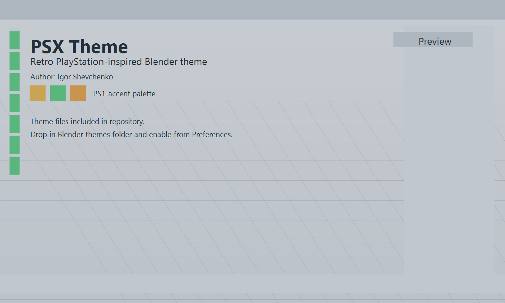

# PSX Blender Theme

Retro PlayStation 1 inspired Blender theme for Blender 5.0+.

## Files

- `psx_theme.xml` - main Blender theme file
- `blender_manifest.toml` - theme manifest

## Author

Igor Shevchenko

## Installation

1. Open Blender.
2. Go to `Edit > Preferences > Themes`.
3. Install or copy the theme files into your Blender themes directory.

## Notes

- Designed around a cold gray PS1-style UI base.
- Uses stronger green controls and warm yellow accents for retro contrast.
